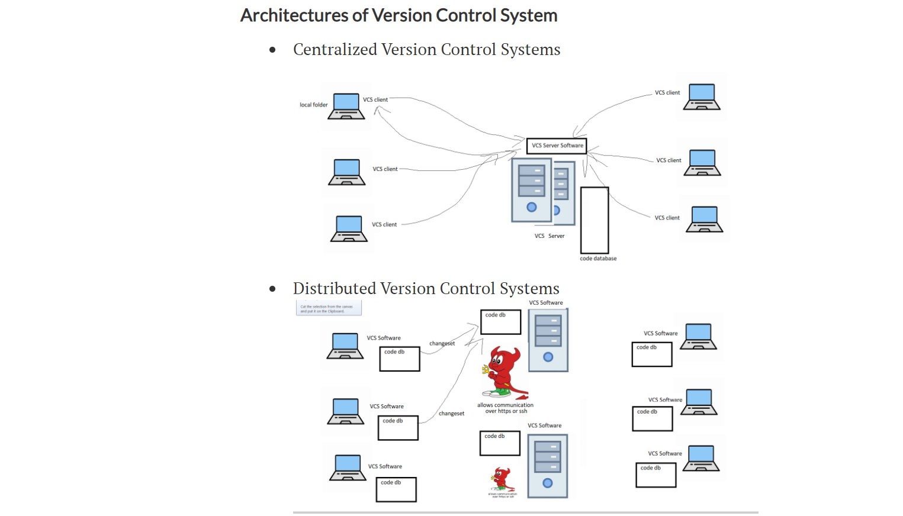

# GIT
* Git is a distributed version controll system 
* tracking changes in any set of files 
* useally used for coordinating work among the programmers collabaratively devoloping for source code in software development.
* goals :

    * data integrety 
    * speed 
    * non leanier workflows
    * support for distribution
## IMP Terms
### Repository: 
* repository is a data storage solution where the history is maintained.
* W.R.T CI/CD pipelines we have two majour repositories

    1. Source code repository
    2. Package repository
### VCS:
* VCS is used to store generally code (any files)
* requires :

    * repository features
    * multi-user synchronisation
    * multiple releases parllely
* orchestration of VCS 
## Areas of GIT :
* Working Tree: This is where we make changes
* Staging area: This is intermediate area before sending changes to local repo
* Local Repo: Once the change is in local repo it will have history
