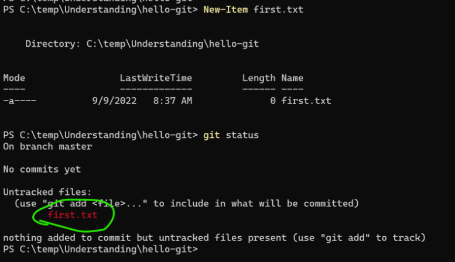
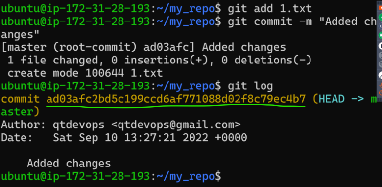
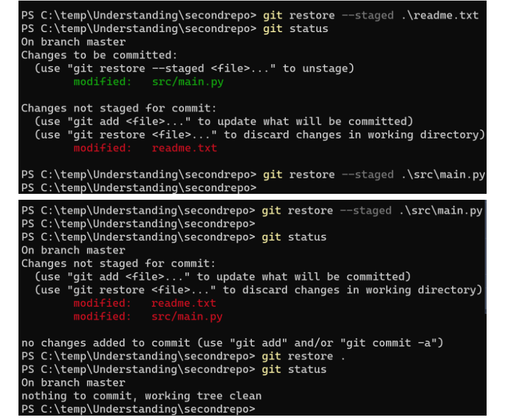
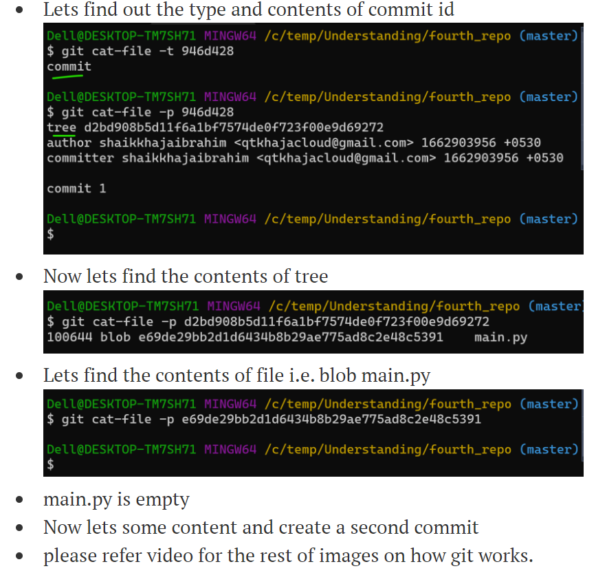
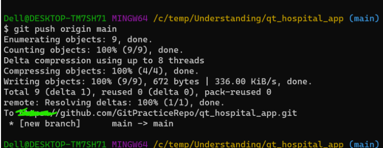

* Verifying if the git is installed or not `git --version`
* use ``git init`` to initialise the empty repository
*  [refer here](https://www.atlassian.com/git/tutorials/atlassian-git-cheatsheet) for the sample cheat sheet
*  using `git status`

    
    * git doesn’t identify an empty folder as a change. only the folders with files are considered as changes
* `git add .` adding the files

    * Deleting a tracked file is considered as change.
    * add the change to staging area and then commit it (even if we delete the tracked file)
*  `git commit -m "added changes"` commiting the chages 

    * Once git create a commit, it gives a commit id.
    * When we add new changes and commit the changes the latest commit will be child of previous commit or previous commit is parent of latest commit
* `git log` displays all of the commits in a repository's history 

    * `git log --oneline` to display 

        * one commit per line
        * the first seven characters of the SHA
        * the commit message
    *  `git log --stat` used to display

        * the files that were modified in each commit
        * the number of lines added or removed
        * a summary line with the total number of files and lines changed
   *  [refer here](https://www.freecodecamp.org/news/git-log-command/#:~:text=The%20git%20log%20command%20displays,author) for more `git log` commands
* To configure username and email id

        `git config --global user.name "qtdevops"`
        `git config --global user.email "qtdevops@gmail.com"`
* `git clean -fd . ` command is used to remove unwanted files from your working directory. This could include removing temporary build artifacts or merge conflict files.
* Removing Changes from staging area to Working Tree `git restore --staged <file name>` 

    * [refer here](https://git-scm.com/docs/git-restore) for more info about git restore 
    * `git cat-file <commit id> -t` shows the type
    * `git cat-file <commit id> -p` shows the content 
    * Git has following object types
        
        * tree => folder
        * blob => file
        * commit
* github ssh key authentication  [refer here](https://directdevops.blog/2022/09/13/devops-classroomnotes-13-sep-2022/)
* Remote repository connection can be added to your local repository `git remote add <name-of-remote> <remote-url>`

    * The default remote name used is `origin`
    * Now we need to push the changes `git push <remote-name> <branch-name>` is the command to push
    
* To see the graph `git log --oneline --graph --all/decorate`
* The `git commit --amend` command is a convenient way to modify the most recent commit

    * It lets you combine staged changes with the previous commit instead of creating an entirely new commit.
    * It can also be used to simply edit the previous commit message without changing its snapshot.
* To rewrite history we need to back by 2 commits and rewrite history `git rebase -i HEAD~2`. This is called as interactive rebase.
* recover a deleted commit [refer here](https://directdevops.blog/2022/09/17/devops-classroomnotes-17-sep-2022/) 

    * exec git reflog
    * note the commit id you want to recover
    * and execute git cherry-pick <commit id>