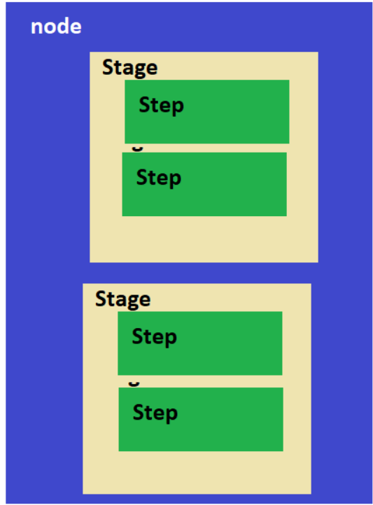

# Jenkins

 Jenkins is a widely used open-source automation server that is used to automate various aspects of software development, including building, testing, and deploying software. It is written in Java and provides a wide range of plugins and integrations with other tools and technologies.

Jenkins allows developers to automate repetitive tasks and perform continuous integration and continuous delivery (CI/CD) of their software applications. It can be easily configured to monitor and trigger builds automatically whenever changes are made to the source code. Jenkins can also be integrated with other tools and technologies such as version control systems, testing frameworks, and deployment tools to provide end-to-end automation of the software development process.

Jenkins is highly extensible and customizable, and it has a large community of users and contributors who develop and maintain a vast array of plugins to enhance its functionality. Jenkins is used by many organizations worldwide to improve the efficiency and reliability of their software development processes.

* Jenkins is a CI/CD engine used to create pipelines
* Jenkins is developed in JAVA language, so jenkins requires JAVA installation on the servers.
* Jenkins is CRON (Scheduler) on Steriods developed for CI/CD Purposes.
* [refer here](https://directdevops.blog/2022/09/17/devops-classroomnotes-17-sep-2022/) for installing jenkins.
* (After complition of installation) A user with name jenkins and home directory `/var/lib/jenkins` got created
* give sudo permissions to the jenkins user and set to `NOPASSWD`
*  [refer here](https://directdevops.blog/2022/09/17/devops-classroomnotes-17-sep-2022-2/) for more info about Jenkins home directory
*   [refer here](https://directdevops.blog/2022/09/17/devops-classroomnotes-17-sep-2022-2/) for connect nodes to Jenkins master
###  [refer here](https://directdevops.blog/2022/09/18/devops-classroomnotes-18-sep-2022/) for detailed notes on maven and maven project goals
## Global Tool Configurations
To make the management of multiple tools or different versions of the same tools Jenkins has Global Tool Configuration

To access the global tool configuration in Jenkins, click on the "Manage Jenkins" link on the Jenkins dashboard, and then select "Global Tool Configuration." This will display a page where administrators can add, remove, or modify the global tools and their configurations. 

For example, to configure a new JDK, an administrator can click on the "JDK installations" section, enter a name for the JDK, specify the path to the JDK installation directory, and configure other options such as environment variables and command-line arguments.

Global tool configuration in Jenkins can save time and effort by allowing administrators to set up and maintain a consistent set of tools and configurations for all jobs and nodes in the Jenkins installation. It also makes it easy to manage updates and changes to the tools, as they can be updated in one place and applied to all jobs and nodes.
* [refer here](https://directdevops.blog/2022/09/22/devops-classroomnotes-22-sep-2022/) to navigate the Jenkins global tool configuration.
* [refer here](https://directdevops.blog/2022/09/24/devops-classroomnotes-24-sep-2022/) for the usage of `POLL SCM` and `Build Periodically`
## Scripted pipeline
* A scripted pipeline is a traditional way of defining a Jenkins pipeline using groovy script, which allows for more flexibility and control.
* It uses a combination of Jenkins Pipeline steps and Groovy code to script the entire pipeline.
* This is extreemly customizable
* The Structure of the Pipeline is as follows
   
* example usage
---
    node {
    stage('test') {
        sh 'echo hello'
    }
    stage('learning') {
        git url: 'https://github.com/GitPracticeRepo/game-of-life.git',
            branch: 'master'
    }
    }
### Declerative pipeline
* A declarative pipeline is a more simplified and opinionated syntax for defining Jenkins pipelines.
* It uses a specific structure and a set of predefined commands and functions to define the pipeline.
* It is more restricted in terms of flexibility but is more easy to read and understand.
* [refer here](https://www.jenkins.io/doc/book/pipeline/syntax/) for official docs
* This has jenkins DSL (Domain Specific Language) which is developed in groovy
* This is optimized around most of the ci/cd pipelines.
* pipeline syntax is as follows 
* example usage
---
    pipeline {
    agent any
    stages {
        stage('test') {
            steps {
                sh 'echo hello'
            }
        }
        stage('learning') {
            steps {
                git url: 'https://github.com/GitPracticeRepo/game-of-life.git', 
                    branch: 'master'
            }
        }
    }
    }
## Jenkins Parameters
* Jenkins Parameters helps in getting additional information during the build. User can pass options
* In Jenkins, parameters can be used to customize and parameterize your builds, allowing you to create more flexible and dynamic jobs that can be executed with different inputs
* [refer here](https://www.jenkins.io/doc/book/pipeline/syntax/#parameters-example) for official docs/example usage 
* [refer here](https://directdevops.blog/2022/09/27/devops-classroomnotes-27-sep-2022/) for the class room notes
* the following are the available parameters

    * string
    * text
    * booleanParam
    * choice
    * password
*  [refer here](https://github.com/GitPracticeRepo/spring-petclinic/commit/aa9c7d0b5ddbb27efc680c69a339ab8d3253fe4d) for parameters usage in class room notes
### [refer here](https://directdevops.blog/2022/09/27/devops-classroomnotes-27-sep-2022/) for triggers in jenkins and Email notifications
