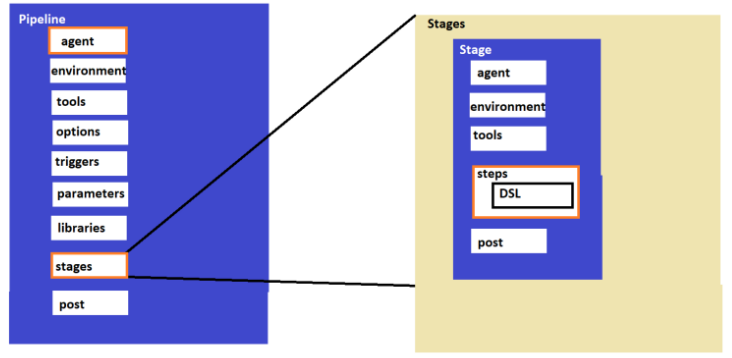

# Jenkins

        Jenkins is a self-contained, open source automation server which can be used to automate all sorts of tasks related to building, testing, and delivering or deploying software.

* Jenkins is a CI/CD engine used to create pipelines
* Jenkins is developed in JAVA language, so jenkins requires JAVA installation on the servers.
* Jenkins is CRON (Scheduler) on Steriods developed for CI/CD Purposes.
* [refer here](https://directdevops.blog/2022/09/17/devops-classroomnotes-17-sep-2022/) for installing jenkins.
* (After complition of installation) A user with name jenkins and home directory `/var/lib/jenkins` got created
* give sudo permissions to the jenkins user and set to `NOPASSWD`
*  [refer here](https://directdevops.blog/2022/09/17/devops-classroomnotes-17-sep-2022-2/) for more info about Jenkins home directory
*   [refer here](https://directdevops.blog/2022/09/17/devops-classroomnotes-17-sep-2022-2/) for connect nodes to Jenkins master
###  [refer here](https://directdevops.blog/2022/09/18/devops-classroomnotes-18-sep-2022/) for detailed notes on maven and maven project goals
## Global Tool Configurations
    To make the management of multiple tools or different versions of the same tools Jenkins has Global Tool Configuration
* [refer here](https://directdevops.blog/2022/09/22/devops-classroomnotes-22-sep-2022/) to navigate the Jenkins global tool configuration.
* [refer here](https://directdevops.blog/2022/09/24/devops-classroomnotes-24-sep-2022/) for the usage of `POLL SCM` and `Build Periodically`
### Scripted pipeline
* A scripted pipeline is a traditional way of defining a Jenkins pipeline using groovy script, which allows for more flexibility and control.
* It uses a combination of Jenkins Pipeline steps and Groovy code to script the entire pipeline.
* This is extreemly customizable
* The Structure of the Pipeline is as follows
   
* example usage
---
    node {
    stage('test') {
        sh 'echo hello'
    }
    stage('learning') {
        git url: 'https://github.com/GitPracticeRepo/game-of-life.git',
            branch: 'master'
    }
    }
### Declerative pipeline
* A declarative pipeline is a more simplified and opinionated syntax for defining Jenkins pipelines.
* It uses a specific structure and a set of predefined commands and functions to define the pipeline.
* It is more restricted in terms of flexibility but is more easy to read and understand.
* [refer here](https://www.jenkins.io/doc/book/pipeline/syntax/) for official docs
* This has jenkins DSL (Domain Specific Language) which is developed in groovy
* This is optimized around most of the ci/cd pipelines.
* pipeline syntax is as follows 
* example usage
---
    pipeline {
    agent any
    stages {
        stage('test') {
            steps {
                sh 'echo hello'
            }
        }
        stage('learning') {
            steps {
                git url: 'https://github.com/GitPracticeRepo/game-of-life.git', 
                    branch: 'master'
            }
        }
    }
    }
