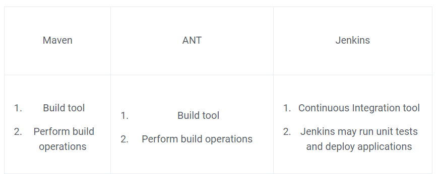

## Name some of the useful plugins in Jenkins.
Jenkins is an open-source automation server that provides hundreds of plugins to support building, deploying, and automating any project. The plugins in Jenkins help extend its functionality, making it possible to integrate with various tools and systems. Some of the most commonly used plugins in Jenkins are:

* Git Plugin: This plugin integrates Jenkins with Git version control system.

* Maven Plugin: This plugin allows Jenkins to build and test Java projects based on Apache Maven.

* Slack Plugin: This plugin integrates Jenkins with Slack, allowing users to receive notifications about builds, tests, and deployments.

* Docker Plugin: This plugin enables Jenkins to build and deploy Docker containers.

* Pipeline Plugin: This plugin enables you to implement and automate Continuous Delivery pipelines in Jenkins.

* SonarQube Plugin: This plugin integrates Jenkins with SonarQube, a static code analysis tool, to perform code quality checks.

These are just a few examples of the many plugins available in Jenkins. It's important to choose the right plugins based on your specific needs and requirements.

----
## How can you create a backup and copy files in Jenkins?
In Jenkins, you can create a backup and copy files in several ways:

* Backup Jenkins configuration: To backup the Jenkins configuration, you can use the "Jenkins CLI" to backup the XML configuration files of your Jenkins instance. You can run the following command in the terminal to backup the Jenkins configuration:

        java -jar jenkins-cli.jar -s http://<Jenkins_URL>/ backup <backup-file-name.zip>
* Backup plugins: You can also backup the plugins installed in Jenkins. You can navigate to the "Jenkins" home page, click on "Manage Jenkins", and then "Backup Manager" to create a backup of the plugins.
  * Install the Backup Plugin: The Backup Plugin can be installed from the "Manage Plugins" section in Jenkins. You can search for the "Backup" plugin, install it, and restart Jenkins for the changes to take effect.

  * Configure Backup Settings: After installing the plugin, you can navigate to "Manage Jenkins" > "Backup Manager" to configure the backup settings. You can specify the backup file location, the backup frequency, and the retention policy.

  * Create a Backup: Once the backup settings are configured, you can create a backup by clicking on the "Backup now" button. The plugin will create a backup of your Jenkins configuration, jobs, plugins, and other data.

  * Restore a Backup: If you need to restore a backup, you can navigate to "Manage Jenkins" > "Backup Manager" and click on the "Restore" button. You can select the backup file that you want to restore, and the plugin will restore the configuration and data to your Jenkins instance.

* Copy files using the "File Operations" plugin: To copy files between different locations, you can use the "File Operations" plugin in Jenkins. This plugin provides a "copy" build step that you can use to copy files between different locations.
  * The "File Operations" plugin in Jenkins allows you to perform various file operations, such as copying, moving, and deleting files, as part of your build process. Here's how you can use the File Operations plugin in Jenkins:

  * Install the Plugin: The File Operations plugin can be installed from the "Manage Plugins" section in Jenkins. You can search for the "File Operations" plugin, install it, and restart Jenkins for the changes to take effect.

  * Create a Job: In Jenkins, create a new job or configure an existing job that you want to use the File Operations plugin.

  * Add a Build Step: In the job configuration, add a new build step by selecting the "File Operations" build step. You can choose the type of operation you want to perform, such as "Copy files".

  * Configure the Build Step: In the build step configuration, you can specify the source and target directories, the files to be copied, and any other settings specific to the operation.

  * Save and Run the Job: Once the build step is configured, save the job configuration and run the job to perform the file operation.
  * example:

            pipeline {
              agent any
              stages {
                  stage('Copy files') {
                      steps {
                          fileOperations([fileCopyOperation(
                              sourceFiles: '/path/to/source/files/**',
                              excludes: '',
                              targetLocation: '/path/to/target/directory',
                              flattenFiles: false,
                              continueOnError: true
                          )])
                      }
                  }
              }
          }

In this example, we're copying all files from the `/path/to/source/files` directory to the `/path/to/target/directory`. You can customize the `sourceFiles`, `excludes`, `targetLocation`, `flattenFiles`, and `continueOnError` parameters as needed for your specific use case.

Note that the File Operations plugin must be installed in your Jenkins environment for the `fileOperations` step to work.

* Copy files using the "Copy Artifact" plugin: You can also use the "Copy Artifact" plugin to copy files between different builds in Jenkins. This plugin provides a "Copy artifacts from another project" build step that you can use to copy files from one build to another.
  * The "Copy Artifact" plugin in Jenkins allows you to copy artifacts, such as build artifacts, from one build to another. This can be useful in situations where you need to use the artifacts generated by one build in another build. Here's how you can use the Copy Artifact plugin in Jenkins:

  * Install the Plugin: The Copy Artifact plugin can be installed from the "Manage Plugins" section in Jenkins. You can search for the "Copy Artifact" plugin, install it, and restart Jenkins for the changes to take effect.

  * Create a Source Job: In Jenkins, create a new job or configure an existing job that generates the artifacts that you want to copy.

  * Create a Target Job: In Jenkins, create another job or configure an existing job that needs to use the artifacts generated by the source job.

  * Add a Build Step: In the target job configuration, add a new build step by selecting the "Copy artifacts from another project" build step.

  * Configure the Build Step: In the build step configuration, you can specify the source job, the build number, and the artifacts to be copied. You can also specify any other settings specific to the copy operation.

  * Save and Run the Job: Once the build step is configured, save the job configuration and run the job to perform the artifact copy.
  * here's an example build step for copying artifacts from a source directory in a Jenkins pipeline:

        stage('Copy Artifacts') {
          steps {
            sh 'cp -r /path/to/source/directory /path/to/destination/directory'
        }
        }
(or)

        pipeline {
          agent any
            stages {
              stage('Copy artifacts') {
                steps {
                  copyArtifacts(
                      projectName: 'my-project',
                      filter: '**/*.jar',
                      selector: lastSuccessful(),
                      target: '/path/to/target/directory'
                )
            }
        }
        }
        }

These are some of the ways to create a backup and copy files in Jenkins. You can choose the method that best suits your requirements and use it to manage your files and configurations.

----
## How can you deploy a custom build of a core plugin?
To deploy a custom build of a core plugin in Jenkins, you need to follow these steps:

* Build the Plugin: The first step is to build the custom plugin. This involves making the necessary changes to the plugin code, compiling it, and creating a .hpi file.

* Copy the Plugin to Jenkins: Next, you need to copy the custom plugin to the plugins directory of your Jenkins installation. This directory is typically located at $JENKINS_HOME/plugins.

* Restart Jenkins: After copying the plugin, you need to restart Jenkins for the changes to take effect. You can do this by navigating to "Manage Jenkins" > "Restart".

* Verify the Plugin: Once Jenkins has restarted, you can verify that the custom plugin is installed and working by navigating to "Manage Jenkins" > "Manage Plugins".

Note: If you are deploying a custom build of a core plugin that has a different version number than the version currently installed in Jenkins, you may need to uninstall the existing plugin before installing the custom plugin.

By following these steps, you can deploy a custom build of a core plugin in Jenkins. However, keep in mind that deploying custom builds of core plugins can introduce compatibility issues, so make sure to thoroughly test the custom plugin before deploying it in a production environment.

------------------
## What could be the steps to move or copy Jenkins from one server to another?
Here are the steps to move or copy Jenkins from one server to another:

* Backup Jenkins Data: Before moving Jenkins to another server, it's important to backup all the important data, including the Jenkins home directory, jobs configuration, plugins, and other files. You can use the Jenkins Backup Plugin or manually backup the Jenkins home directory.

* Install Jenkins on the Target Server: Next, you need to install Jenkins on the target server. You can install Jenkins using the official installation guide or use a pre-configured Jenkins image from a cloud provider.

* Restore the Backup Data: After installing Jenkins on the target server, you can restore the backup data to the Jenkins home directory. You can restore the backup data using the Jenkins Backup Plugin or manually copying the files to the Jenkins home directory.

* Verify the Configuration: After restoring the backup data, you should verify that the Jenkins configuration and jobs are working correctly. You can do this by accessing the Jenkins URL and checking the jobs and configuration settings.

* Update the Jenkins URL: If you are moving Jenkins to a new server with a different URL, you need to update the Jenkins URL. You can do this by navigating to "Manage Jenkins" > "Configure System" and updating the "Jenkins URL" setting.

* Reinstall Plugins: Finally, you need to reinstall any plugins that were not included in the backup. You can do this by navigating to "Manage Jenkins" > "Manage Plugins" and installing the required plugins.

These are the basic steps to move or copy Jenkins from one server to another. By following these steps, you can ensure a smooth transition and minimize downtime.

-------------------
## Assume that you have a pipeline. The first job that you performed was successful, but the second one failed.  What would you do now?
If the first job in a pipeline was successful but the second one failed, here are the steps you can take to troubleshoot and resolve the issue:

* Check the Build Logs: The first step is to check the build logs of the failed job. The build logs will provide detailed information about the error and can help you understand the cause of the failure. You can access the build logs by clicking on the failed build and selecting the "Console Output" option.

* Analyze the Error: Once you have the build logs, you need to analyze the error and determine the cause of the failure. This may involve reviewing the code, checking the configuration, or investigating any other factors that may have contributed to the failure.

* Fix the Issue: Based on the analysis, you can make the necessary changes to fix the issue. This may involve modifying the code, updating the configuration, or addressing any other factors that were causing the failure.

* Re-run the Job: Once the issue is resolved, you can re-run the failed job. If the job runs successfully, the pipeline will continue to the next stage. If the job fails again, you need to repeat the above steps to troubleshoot and resolve the issue.

* Monitor the Pipeline: Finally, you should monitor the pipeline to ensure that all jobs run successfully and there are no additional failures. You can do this by regularly checking the pipeline status and build logs.

These are the basic steps to follow if a job in a pipeline fails. By following these steps, you can identify and resolve the issue, and ensure that the pipeline continues to run smoothly.

--------------
## What is Jenkinsfile? 
Jenkinsfile is a file that defines a pipeline in Jenkins. It is written in a domain-specific language called "Groovy" and specifies all the steps that Jenkins should execute in order to build, test, and deploy a software project. The Jenkinsfile is stored in the source code repository of the software project, just like any other source code file, and is version-controlled along with the rest of the code.

A Jenkinsfile specifies the entire CI/CD pipeline, including:

* The source code repository and branch to use
* The steps for building the project
* The steps for testing the project
* The steps for deploying the project
* Any other relevant steps in the CI/CD process
  
When Jenkins builds a project, it checks the code repository for a Jenkinsfile and uses the instructions in the file to execute the pipeline. This makes it easy for developers to set up and maintain the CI/CD pipeline for their projects, as the pipeline is defined in code and stored in the source code repository.

In addition, the Jenkinsfile makes it easy to share the CI/CD pipeline between teams and projects, as the pipeline is stored in the source code repository and can be easily reused in other projects.
## Differentiate between Maven, Ant, and Jenkins.

--------------
## What are some of the default environmental variables in Jenkins?
Jenkins provides a number of default environment variables that can be used in your Jenkinsfile, shell scripts, or other parts of your CI/CD pipeline. Here are some of the most commonly used default environment variables in Jenkins:

* BUILD_NUMBER: The number assigned to the current build.

* BUILD_ID: A unique identifier for the current build.

* JOB_NAME: The name of the Jenkins job that is currently executing.

* WORKSPACE: The absolute path to the directory on the Jenkins machine where the Jenkins job is executed.

* BUILD_URL: The URL to the build results page on the Jenkins server.

* NODE_NAME: The name of the Jenkins node where the build is executed.

* JENKINS_URL: The URL of the Jenkins server.

* GIT_COMMIT: The commit ID of the Git revision being built.

* GIT_URL: The URL of the Git repository being built.

* GIT_BRANCH: The name of the Git branch being built.

These environment variables can be accessed and used in your Jenkinsfile, shell scripts, or other parts of your CI/CD pipeline. For example, you can use the WORKSPACE environment variable to specify the directory where your build artifacts should be stored, or the GIT_COMMIT environment variable to retrieve the commit ID of the Git revision being built.

-----
## What is the process of making a Multibranch Pipeline in Jenkins?
A multibranch pipeline in Jenkins allows you to automatically build, test, and deploy multiple branches of a Git repository using a single Jenkins job. Here is the process to create a multibranch pipeline in Jenkins:

* Install the necessary plugins: Before creating a multibranch pipeline, you need to make sure that the necessary plugins are installed on your Jenkins instance. The plugins required for multibranch pipelines include the Git plugin and the Jenkins Pipeline plugin.

* Create a new Jenkins job: In the Jenkins dashboard, click on "New Item" and select "Multibranch Pipeline". Give your job a name, and click "OK".

* Configure the Git repository: In the job configuration, go to the "Source Code Management" section and select "Git". Enter the URL of your Git repository and specify the repository credentials if necessary.

* Set up a Jenkinsfile: In your Git repository, create a file named "Jenkinsfile" and specify the pipeline steps you want Jenkins to execute for each branch.

* Configure the branch source: In the job configuration, go to the "Branch Sources" section and select "Git". Enter the repository URL and specify the repository credentials if necessary. Choose the scan interval for your repository and select the branches you want to build.

* Save and run the job: Save the job configuration and run the job by clicking "Build Now". Jenkins will automatically scan your Git repository for new branches, create pipeline jobs for each branch, and execute the pipeline steps specified in the Jenkinsfile for each branch.

That's it! You have successfully created a multibranch pipeline in Jenkins. Whenever you push a new branch to your Git repository, Jenkins will automatically create a pipeline job for that branch and execute the pipeline steps specified in your Jenkinsfile. This makes it easy to manage and automate the development and deployment process for multiple branches of your software projects.

-----------
## How can the parameters be defined in Jenkins?
Jenkins allows you to define build parameters for your jobs to make them more flexible and configurable. There are several types of parameters that you can use, including:

* String Parameter: Used to specify a string value as the parameter.

* Boolean Parameter: Used to specify a boolean value (true or false) as the parameter.

* Choice Parameter: Used to specify a list of predefined values as the parameter. The user can select one of the values when they build the job.

* File Parameter: Used to specify a file as the parameter. The file will be uploaded to the Jenkins master and made available to the build environment.

* Password Parameter: Used to specify a password as the parameter. The password will be encrypted before being stored in Jenkins and can only be viewed by users with the necessary permissions.

* Run Parameter: Used to specify a build number or a build pipeline as the parameter.

To define parameters for your Jenkins job, you can go to the job's configuration page and find the "Build Environment" section. There, you can select the type of parameter you want to add, and provide the necessary details, such as the parameter name, default value, and options (for choice parameters). After saving the changes, you will be able to specify the values for these parameters when you run a build.

----
## Key components of Jenkins:
Jenkins is an open-source automation server that is widely used for continuous integration and continuous delivery (CI/CD) of software. Here are some of the key components of Jenkins:

* Plugins: Jenkins is highly extensible and can be customized through the use of plugins. There are over 1,000 plugins available that provide a wide range of functionality, including support for source code management systems, build tools, test frameworks, and deployment tools.

* Jobs: Jobs are the basic building blocks of Jenkins and are used to define the steps involved in building, testing, and deploying software. Jobs can be created and configured through the Jenkins web interface or by using the Jenkinsfile script.

* Build Agents: Build agents are used to run Jenkins jobs. Jobs can be executed on the same machine as the Jenkins server or on remote machines. Jenkins supports distributed builds, allowing jobs to be executed in parallel on multiple build agents for improved performance.

* Source Code Management (SCM) Systems: Jenkins supports a wide range of source code management (SCM) systems, including Git, Subversion, and Mercurial. Jenkins can be configured to automatically build and test software whenever changes are pushed to the SCM repository.

* Build Triggers: Build triggers are used to automatically start builds in response to specific events, such as a code change in the SCM repository or the completion of another build.

* Build Pipelines: Jenkins supports build pipelines, which are sequences of interconnected jobs that perform different stages of the CI/CD process, such as building, testing, and deploying software.

* Dashboards and Reporting: Jenkins provides a range of reporting and visualization tools, including build history, test results, and performance metrics. Jenkins also provides a number of plugins that provide additional reporting and visualization options, such as the Build Pipeline Plugin and the Jenkins Performance Plugin.

* Security: Jenkins supports a range of security features, including user authentication and authorization, and the ability to secure sensitive information, such as credentials and passwords, using the Credentials Plugin.

These are some of the key components of Jenkins that make it a popular and powerful tool for CI/CD. By combining these components, Jenkins provides a flexible and scalable solution for automating the build, test, and deployment of software.

----
## Key features of Jenkins:
Jenkins is a popular open-source automation server that is widely used for continuous integration and continuous delivery (CI/CD) of software. Here are some of the key features of Jenkins:

* Open Source: Jenkins is an open-source project, which means that it is free to use and has a large and active community of developers contributing to its development and maintenance.

* Plugins: Jenkins is highly extensible and can be customized through the use of plugins. There are over 1,000 plugins available that provide a wide range of functionality, including support for source code management systems, build tools, test frameworks, and deployment tools.

* Build Automation: Jenkins automates the build, test, and deployment of software, making it easier to manage and maintain the software development process.

* Distributed Builds: Jenkins supports distributed builds, allowing jobs to be executed in parallel on multiple build agents for improved performance.

* Source Code Management (SCM) Systems: Jenkins supports a wide range of source code management (SCM) systems, including Git, Subversion, and Mercurial. Jenkins can be configured to automatically build and test software whenever changes are pushed to the SCM repository.

* Build Pipelines: Jenkins supports build pipelines, which are sequences of interconnected jobs that perform different stages of the CI/CD process, such as building, testing, and deploying software.

* Dashboards and Reporting: Jenkins provides a range of reporting and visualization tools, including build history, test results, and performance metrics. Jenkins also provides a number of plugins that provide additional reporting and visualization options, such as the Build Pipeline Plugin and the Jenkins Performance Plugin.

* Continuous Integration and Continuous Delivery (CI/CD): Jenkins provides a complete CI/CD solution that makes it easy to automate the build, test, and deployment of software.

* Security: Jenkins supports a range of security features, including user authentication and authorization, and the ability to secure sensitive information, such as credentials and passwords, using the Credentials Plugin.

* Customization: Jenkins provides a rich API and a large library of plugins, making it highly customizable to meet the needs of individual software development teams.

These are some of the key features of Jenkins that make it a powerful and flexible tool for CI/CD. By combining these features, Jenkins provides a scalable solution for automating the build, test, and deployment of software.

----
## what are the stages prasent in jenkins pipeline to build a project ?
Jenkins is a popular open-source automation server that allows users to automate the building, testing, and deployment of software applications. Jenkins pipelines provide a powerful way to define and orchestrate complex continuous integration and delivery workflows. Here are the stages typically present in a Jenkins pipeline to build a project:

* Checkout: This stage involves checking out the source code from the version control system. For example, if the code is stored in a Git repository, the pipeline will clone the repository to a local workspace.

* Build: This stage involves compiling the source code and creating the application artifacts. Depending on the programming language and build tool used, this stage may involve running commands such as mvn clean install for a Maven project or npm build for a Node.js project.

* Test: This stage involves running automated tests to ensure that the application works as expected. Depending on the application, tests may include unit tests, integration tests, functional tests, or performance tests.

* Static Analysis: This stage involves running static code analysis tools to identify issues in the source code such as potential bugs, code smells, or security vulnerabilities.

* Code Coverage: This stage involves measuring the code coverage of the automated tests, which helps to ensure that the tests cover a sufficient portion of the codebase.

* Artifact Packaging: This stage involves packaging the application artifacts into a deployable format such as a JAR, WAR, or Docker image.

* Deployment: This stage involves deploying the application artifacts to a target environment such as a test or production server. Depending on the deployment strategy, this stage may involve running scripts to start or stop services, configure load balancers, or perform database migrations.

* Post-deployment Testing: This stage involves running additional tests to ensure that the application is functioning correctly in the target environment.

* Notification: This stage involves notifying stakeholders about the build status, test results, and deployment status. Notifications may be sent via email, chat, or other communication channels.

These stages may be combined or modified to suit the needs of the specific application and development team. Jenkins pipelines offer a flexible and powerful way to automate the entire software delivery process, from code commit to production deployment.

example:

    pipeline {
    agent any

    stages {
        stage('Checkout') {
            steps {
                checkout([$class: 'GitSCM',
                          branches: [[name: '*/master']],
                          userRemoteConfigs: [[url: 'https://github.com/openmrs/openmrs-core.git']]])
            }
        }
        stage('Build') {
            steps {
                sh 'mvn clean install -DskipTests'
            }
        }
        stage('Test') {
            steps {
                sh 'mvn test'
            }
        }
        stage('Static Analysis') {
            steps {
                sh 'mvn sonar:sonar'
            }
        }
        stage('Code Coverage') {
            steps {
                sh 'mvn jacoco:report'
            }
        }
        stage('Artifact Packaging') {
            steps {
                sh 'mvn package'
            }
        }
        stage('Deployment') {
            steps {
                sh './deploy.sh'
            }
        }
        stage('Post-deployment Testing') {
            steps {
                sh 'mvn verify'
            }
        }
        stage('Notification') {
            steps {
                emailext (
                    subject: "OpenMRS Build Status: ${currentBuild.result}",
                    body: "Build Status: ${currentBuild.result}",
                    to: "developers@example.com",
                    replyTo: "admin@example.com",
                    mimeType: 'text/html'
                )
            }
        }
    }
}

----
## what is the quality profile in the sonar ?
In SonarQube, a quality profile is a set of rules, settings, and configurations that define the quality standards for a specific programming language or technology. The quality profile is used to analyze the code and identify issues such as bugs, code smells, and security vulnerabilities.

Each quality profile in SonarQube includes a set of pre-defined rules for the programming language or technology being analyzed, and each rule has a severity level (e.g. critical, major, minor, etc.). Users can also add their own custom rules to a quality profile.

When you run a code analysis in SonarQube, the quality profile is used to evaluate the code and generate a report on the quality of the code. The report includes information such as the number and severity of issues found, and suggestions for how to improve the code.

In summary, a quality profile is a key component of code quality management in SonarQube, and it is used to enforce consistent coding standards and ensure that the code is maintainable, reliable, and secure.

----
## what to do if code quality gate is failed ?
If the code quality gate fails in SonarQube, it means that the code does not meet the quality standards that you have defined in the quality profile. The failed gate indicates that the code has too many issues of certain severity levels, and does not meet the minimum quality requirements that you have set.

To address a failed quality gate, you should follow these steps:

1. Review the code quality report: Look at the code quality report in SonarQube to see which rules have failed and which issues have been identified. This will give you a better understanding of the issues that need to be addressed.

2. Prioritize the issues: Identify the most critical issues and prioritize them based on their severity level and impact on the code. Focus on the most critical issues first, as they can have the greatest impact on the overall quality of the code.

3. Fix the issues: Once you have identified the most critical issues, you should start fixing them one by one. Depending on the type of issue, this may involve refactoring code, adding additional tests, or implementing new coding practices.

4. Re-run the analysis: After you have fixed the issues, you should re-run the analysis in SonarQube to see if the code quality gate has passed. If it has, then you can continue with the next steps of the development process. If it has not, then you should repeat the process of identifying and fixing the remaining issues until the gate is passed.

In summary, when the code quality gate fails, you should review the code quality report, prioritize the issues, fix the issues, and re-run the analysis until the gate is passed. This process helps to ensure that your code meets the quality standards that you have defined, and that it is maintainable, reliable, and secure.

----
## what is the master and slave in the jenkins ?
In Jenkins, a master node is the main Jenkins server, which is responsible for coordinating all the build jobs and distributing them to the slave nodes for execution. The master node is where the Jenkins configuration is stored, and it is also where the web interface is hosted.

A slave node, also known as a worker node, is a separate machine or environment that is used to offload the actual build or test work from the master node. Slave nodes are used to distribute the build load across multiple machines and can be either physical or virtual machines.

In a Jenkins setup, the master node manages the overall build process and is responsible for delegating individual build jobs to the appropriate slave nodes for execution. The slave nodes can be configured to run specific builds or tests based on their capabilities and resources, which allows for parallel execution of builds across multiple machines.

In summary, the master node is the main Jenkins server that manages the build process and coordinates the distribution of build jobs to slave nodes for execution, while the slave nodes are separate machines or environments that are used to offload the actual build or test work from the master node. Together, the master and slave nodes allow for distributed and parallel execution of builds, which can greatly increase the speed and efficiency of the build process.

----

