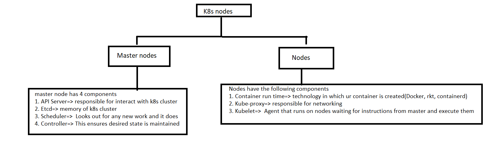
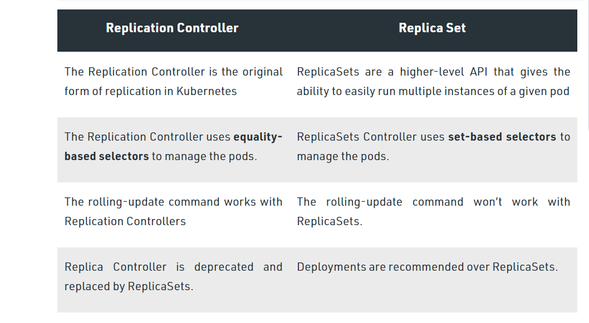
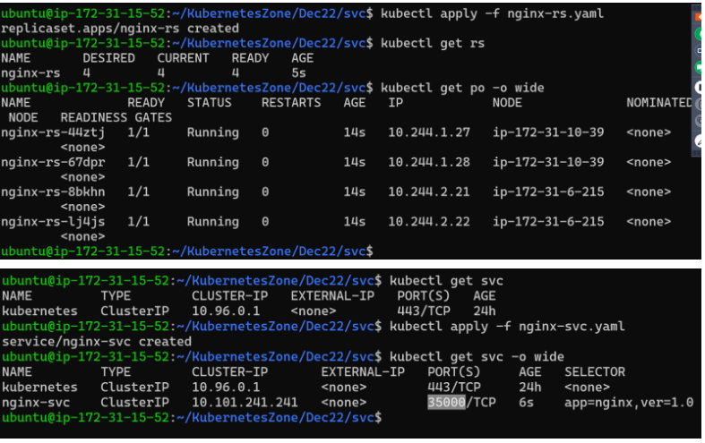
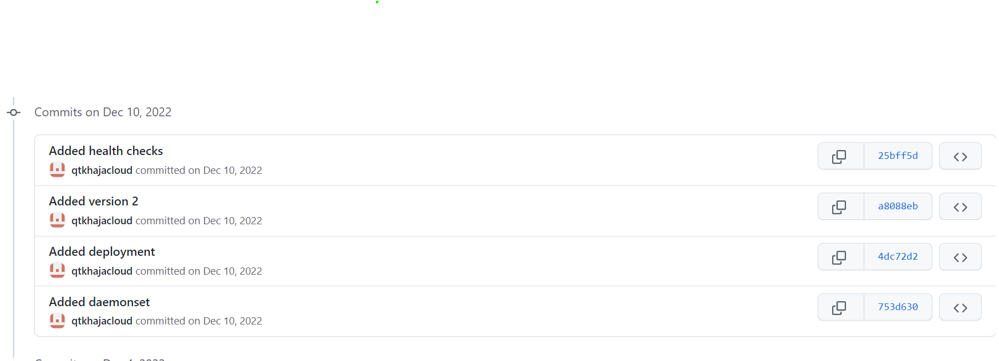

# kubernetes
kubernetes is an open source container orchestration engine for automating deployment, scaling, and management of containerised applications
    => one of the major propertice of the k8s is self healing
* k8s is desigend to work with any container technology
* yaml files where we describe our desired state are called as manifests
## k8s Architecture
* 
* kubectl: A command-line tool that allows you to interact with the API server to manage your cluster.

### difference between replication controller and replicaset 

## Pod:
* smallest unit of creation in k8s
* pod have containers which can run apllications
* each pod getts a unique ip address
* all containers in the pod share the same network namespace

### Pod lifecycle:
This page describes the lifecycle of a Pod. Pods follow a defined lifecycle, starting in the Pending phase, moving through Running if at least one of its primary containers starts OK, and then through either the Succeeded or Failed phases depending on whether any container in the Pod terminated in failure.

Whilst a Pod is running, the kubelet is able to restart containers to handle some kind of faults. Within a Pod, Kubernetes tracks different container states and determines what action to take to make the Pod healthy again.

In the Kubernetes API, Pods have both a specification and an actual status. The status for a Pod object consists of a set of Pod conditions. You can also inject custom readiness information into the condition data for a Pod, if that is useful to your application.

Pods are only scheduled once in their lifetime. Once a Pod is scheduled (assigned) to a Node, the Pod runs on that Node until it stops or is terminated

### Pod lifetime:
Like individual application containers, Pods are considered to be relatively ephemeral (rather than durable) entities. Pods are created, assigned a unique ID (UID), and scheduled to nodes where they remain until termination (according to restart policy) or deletion. If a Node dies, the Pods scheduled to that node are scheduled for deletion after a timeout period.

Pods do not, by themselves, self-heal. If a Pod is scheduled to a node that then fails, the Pod is deleted; likewise, a Pod won't survive an eviction due to a lack of resources or Node maintenance. Kubernetes uses a higher-level abstraction, called a controller, that handles the work of managing the relatively disposable Pod instances.

A given Pod (as defined by a UID) is never "rescheduled" to a different node; instead, that Pod can be replaced by a new, near-identical Pod, with even the same name if desired, but with a different UID.

When something is said to have the same lifetime as a Pod, such as a volume, that means that the thing exists as long as that specific Pod (with that exact UID) exists. If that Pod is deleted for any reason, and even if an identical replacement is created, the related thing (a volume, in this example) is also destroyed and created anew.

### Pod phase:
* Pending: 
  * The Pod has been accepted by the Kubernetes cluster, but one or more of the containers has not been set up and made ready to run. This includes time a Pod spends waiting to be scheduled as well as the time spent downloading container images over the network.
* Running:
  * The Pod has been bound to a node, and all of the containers have been created. At least one container is still running, or is in the process of starting or restarting.
* Succeeded:
  * All containers in the Pod have terminated in success, and will not be restarted.
* Failed:
  * All containers in the Pod have terminated, and at least one container has terminated in failure. That is, the container either exited with non-zero status or was terminated by the system.
* Unknown:
  * For some reason the state of the Pod could not be obtained. This phase typically occurs due to an error in communicating with the node where the Pod should be running.

### Pod restart policy:
In Kubernetes, a restart policy is a directive that determines what action to take when a container in a pod exits. There are three restart policies in Kubernetes:

* Always: With this policy, Kubernetes will always attempt to restart the container when it exits, regardless of the exit code or reason for the exit. This is the default restart policy.

* OnFailure: With this policy, Kubernetes will only attempt to restart the container if it exits with a non-zero exit code.

* Never: With this policy, Kubernetes will never attempt to restart the container, even if it exits unexpectedly.

Example yaml file:

        ---
        apiVersion: v1
        kind: Pod
        metadata:
        name: restart-never
        spec:
        containers:
            - name: restart-never
            image: alpine:3
            command:
                - sleep
                - "2"
        restartPolicy: Never
        ---
        apiVersion: v1
        kind: Pod
        metadata:
        name: restart-nopolicy
        spec:
        containers:
            - name: restart-nopolicy
            image: alpine:3
            command:
                - sleep
                - "2"

### Pod can run 3 types of containers:

1. Containers => Where we run our applications
2. init containers:

   * These containers are created one by one and only after its completion, the normal containers are created.
   * We will use these containers for any initial setup or configuration kind of purposes
   * Example

            ---
            apiVersion: v1
            kind: Pod
            metadata:
                name: init-demo
            spec:
                initContainers:
                    - name: init-cont1
                      image: alpine:3
                      command:
                        - sleep
                        - "30"
                    - name: init-cont2
                      image: alpine:3
                      command:
                        - sleep
                        - "30"
                containers:
                    - name: nginx
                      image: nginx:1.23
                      ports:
                         - containerPort: 80
                           protocol: TCP

3. ephemeral containers:

    * No guarantee containers, they are used rarely in the case of debugging or trouble shooting containers in Pod

 [refer here](https://kubernetes.io/docs/reference/generated/kubectl/kubectl-commands#run) for some example imperative commands

 ## Replication Controller:
 * There are many cases where we would want to run multiple instance of a application.
* In k8s we run application in Pod and to set mutlple instances we use replica sets or replication controllers.
* Replication Controller is the first gen replica workload for k8s objects.
* Replication Controller labels can be matched only on equality not set based
* [refer here](https://kubernetes.io/docs/concepts/overview/working-with-objects/labels/#set-references-in-api-objects) for more info

Example:

        ---
        apiVersion: v1
        kind: ReplicationController
        metadata:
            name: nginx-rc
        spec:
            minReadySeconds: 3
            replicas: 5
            selector:
                matchLabels:
                app: nginx
            template:
                metadata:
                    name: nginx-pod
                    labels:
                        app: nginx
                        ver: "1.23"
                    spec:
                    containers:
                        - name: nginx
                        image: nginx:1.23
                        ports:
                            - containerPort: 80
                            protocol: TCP

## Labels in k8s:
 [refer here](https://kubernetes.io/docs/concepts/overview/working-with-objects/labels/) for official docs
* In k8s as part of metadata we can apply labels to the resources.
* These labels help in querying resources based on conditions according labels defined

Example:

        ---
        apiVersion: v1
        kind: Pod
        metadata:
            name: nginx1
            labels:
                app: nginx
                ver: "1.23"
        spec:
            containers:
                - image: nginx:1.23
                  name: nginx
                  ports: 
                    - containerPort: 80
                      protocol: TCP
            ---
        apiVersion: v1
        kind: Pod
        metadata:
            name: nginx2
            labels:
                app: nginx
                ver: "1.24"
        spec:
            containers:
                - image: nginx:1
                  name: nginx
                  ports: 
                      - containerPort: 80
                        protocol: TCP

## Replica Set:
* This is succesor to Replication Controller.
* Replica Sets are used by Deployments.
* Replica Sets changes can be tracked and that is what the deployment uses.
* [refer here](https://kubernetes.io/docs/concepts/workloads/controllers/replicaset/) for official docs.

Example: 1

        ---
        apiVersion: apps/v1
        kind: ReplicaSet
        metadata:
            name: nginx-rs
            labels:
                app: nginx
        spec:
            minReadySeconds: 3
            replicas: 4
            selector:
                matchExpressions:
                  - key: app
                      operator: In
                      values:
                        - nginx
                        - webserver
                  - key: ver
                        operator: Exists
            template:
                metadata:
                    name: nginx-pod
                    labels:
                        app: nginx
                        ver: "1.23"
                spec:
                    containers:
                        - name: nginx
                          image: nginx:1.23
                          ports:
                              - containerPort: 80
                                protocol: TCP

Example: 2

        apiVersion: apps/v1
        kind: ReplicaSet
        metadata:
            name: cicd
            labels:
                app: jenkins
                purpose: cicd
        spec:
            replicas: 4
            selector:
                matchLabels:
                    purpose: cicd
            template:
                metadata:
                    labels:
                        purpose: cicd
                spec:
                    containers:
                      - name: cicd
                        image: jenkins/jenkins:lts-jdk11
                        ports:
                          - containerPort: 8080
                            protocol: TCP
                    initContainers:
                      - name: ping
                        image: alpine:3.17.0      
                        command: ["ping" ,"-c","4","google.com"]

## advantages of replicaset over replication controller:
ReplicaSets and Replication Controllers are both Kubernetes objects used for managing the replication of pods, ensuring that a certain number of pod replicas are always running in a cluster. However, there are some key advantages to using ReplicaSets over Replication Controllers:

* Selectors: ReplicaSets use set-based selectors, which are more expressive than the equality-based selectors used by Replication Controllers. This means that ReplicaSets can select pods based on a wider range of criteria, such as labels that match certain values, or labels that don't match certain values.

* Rolling updates: ReplicaSets provide more fine-grained control over rolling updates, which is the process of updating pods one at a time to avoid downtime. ReplicaSets allow you to specify the maximum number of pods that can be unavailable during an update, as well as the maximum number of pods that can be created simultaneously. Replication Controllers do not provide this level of control.

* Scalability: ReplicaSets can be used to scale a deployment horizontally, meaning that you can add more replicas of a pod to handle increased traffic or workload. Replication Controllers can also do this, but they do not have the same level of control over updates and scaling that ReplicaSets provide.

* Future-proofing: ReplicaSets are the recommended way to manage pod replication in Kubernetes, and they are intended to replace Replication Controllers in the long term. This means that using ReplicaSets can future-proof your deployments, ensuring that they will continue to work as Kubernetes evolves and new features are added.

Overall, while Replication Controllers are still a valid way to manage pod replication in Kubernetes, ReplicaSets provide more advanced features and greater control over updates and scaling, making them a better choice for many use cases.
## Kubernetes Service:
In Kubernetes, a Service is a method for exposing a network application that is running as one or more Pods in your cluster.

A key aim of Services in Kubernetes is that you don't need to modify your existing application to use an unfamiliar service discovery mechanism. You can run code in Pods, whether this is a code designed for a cloud-native world, or an older app you've containerized. You use a Service to make that set of Pods available on the network so that clients can interact with it.

If you use a Deployment to run your app, that Deployment can create and destroy Pods dynamically. From one moment to the next, you don't know how many of those Pods are working and healthy; you might not even know what those healthy Pods are named. Kubernetes Pods are created and destroyed to match the desired state of your cluster. Pods are emphemeral resources (you should not expect that an individual Pod is reliable and durable).

Each Pod gets its own IP address (Kubernetes expects network plugins to ensure this). For a given Deployment in your cluster, the set of Pods running in one moment in time could be different from the set of Pods running that application a moment later.

This leads to a problem: if some set of Pods (call them "backends") provides functionality to other Pods (call them "frontends") inside your cluster, how do the frontends find out and keep track of which IP address to connect to, so that the frontend can use the backend part of the workload?

 [refer here](https://kubernetes.io/docs/concepts/services-networking/service/) for official docs.

 Example:Nginx.yml

        ---
        apiVersion: apps/v1
        kind: ReplicaSet
        metadata:
            name: nginx-rs
            labels:
                app: nginx
        spec:
            minReadySeconds: 3
            replicas: 4
            selector:
                matchExpressions:
                  - key: app
                    operator: In
                    values:
                      - nginx
                      - webserver
                  - key: ver
                    operator: Exists
            template:
                metadata:
                    name: nginx-pod
                    labels:
                        app: nginx
                        ver: "1.0"
                spec:
                    containers:
                        - name: nginx
                          image: nginx:1.23
                          ports:
                              - containerPort: 80
                                protocol: TCP

Service.yml

        ---
        apiVersion: v1
        kind: Service
        metadata:
            name: nginx-svc
        spec:
            type: ClusterIP
            selector:
                app: nginx
                ver: "1.0"
            ports:
                - name: webport
                  port: 35000
                  targetPort: 80

Create and verify replica set with pods

This svc can be verified only by some Pod in k8s cluster
 
 [refer here](https://directdevops.blog/2022/12/04/devops-classroomnotes-04-dec-2022/) for more info

  [refer here](https://directdevops.blog/2022/12/04/devops-classroomnotes-04-dec-2022-2/) for applying azure load balencer

  ## Resource limits in k8s:
  In Kubernetes, resource limits are used to control the amount of CPU and memory that a container can use. By setting resource limits, you can ensure that a container does not consume too many resources and impact the overall performance and stability of your cluster.

There are two types of resource limits in Kubernetes:

* CPU limits: These limits are specified in CPU units, which represent a fraction of a single CPU core. For example, 0.5 CPU units represents half of a CPU core. CPU limits control the amount of CPU time that a container can use.

* Memory limits: These limits are specified in bytes and control the amount of memory that a container can use.

Resource limits can be set at the container level or at the pod level. When limits are set at the container level, each container in a pod can have its own limits. When limits are set at the pod level, all containers in the pod share the same limits.

* lower limit => requests
* upper limit => limits
* [refer here](https://kubernetes.io/docs/concepts/configuration/manage-resources-containers/) for official docs.

Here is an example of setting resource limits for a container:

        apiVersion: v1
        kind: Pod
        metadata:
            name: my-pod
        spec:
            containers:
                - name: my-container
                  image: my-image
                  resources:
                      limits:
                          cpu: "1"
                          memory: "512Mi"

In this example, the container "my-container" has a CPU limit of 1 CPU unit and a memory limit of 512 megabytes.

Setting resource limits is important to ensure that your cluster remains stable and performs well. Without limits, a single container can consume all available resources, causing performance problems for other containers and the entire cluster.

## Probes in k8s:
In Kubernetes, probes are used to check the health of a container running in a pod. There are three types of probes that can be used:

1. Liveness probe: This type of probe checks if the container is still alive and running. If the liveness probe fails, Kubernetes will try to restart the container.

2. Readiness probe: This type of probe checks if the container is ready to receive traffic. If the readiness probe fails, Kubernetes will stop sending traffic to the container until it passes the probe.

3. Startup probe: This type of probe is used to check if the container has started up successfully. If the startup probe fails, Kubernetes will wait for the container to start up before sending any traffic to it.

* k8s allows us to check this by
    * sending a http(s) request
    * sending a tcp request
    * sending a grpc request
    * send a linux command

Probes are defined in the pod specification and can be configured with various options such as the probe type, the probe frequency, and the probe timeout. Here is an example of a liveness probe:

        apiVersion: v1
        kind: Pod
        metadata:
            name: my-pod
        spec:
            containers:
                - name: my-container
                  image: my-image
                  livenessProbe:
                        httpGet:
                            path: /healthz
                            port: 8080
                        initialDelaySeconds: 5
                        periodSeconds: 10
                        timeoutSeconds: 5
                        failureThreshold: 3

In this example, the liveness probe is configured to send an HTTP GET request to the path "/healthz" on port 8080 every 10 seconds. If the probe fails three times in a row (failureThreshold), Kubernetes will restart the container. The initialDelaySeconds and timeoutSeconds options specify the initial delay before the first probe and the maximum time the probe can take to complete, respectively.

Using probes is important to ensure that your containers are healthy and responsive. By configuring probes, you can detect and recover from failures quickly, improving the overall reliability of your applications running in Kubernetes.

## Daemonset:
* This workload creates a Pod on every node in the k8s cluster
* This is generally used for running agents i.e. log agents, backup agents, heart beat/monitoring agents.

Example:

        ---
        apiVersion: apps/v1
        kind: DaemonSet
        metadata:
            name: myagent-ds
        spec:
            minReadySeconds: 5
            selector:
                matchLabels:
                    app: agent
            template:
                metadata:
                    name: agent-pod
                    labels:
                        app: agent
                        version: v1.0
                spec:
                    containers:
                        - name: agent-pod
                          image: alpine:3
                          command:
                              - sleep
                              - 1d

## Deployments:
Deployment in Kubernetes (often abbreviated as "k8s") is a way to manage a set of identical pods, which are the basic building blocks of a Kubernetes cluster. A deployment is essentially a blueprint for creating and managing a set of replicas (i.e., identical copies) of a pod or set of pods.

When you create a deployment in Kubernetes, you specify the number of replicas you want to create, along with other details such as the container image to use, the ports to expose, and any environment variables or configuration data that should be injected into the container.

Once you've created a deployment, Kubernetes will automatically create the specified number of replicas and ensure that they are running and healthy. If a replica fails or becomes unresponsive, Kubernetes will automatically create a replacement pod to maintain the desired number of replicas.

One of the key benefits of using a deployment in Kubernetes is that it provides a way to perform rolling updates and rollbacks. When you update the container image or configuration data associated with a deployment, Kubernetes will gradually roll out the changes to each replica, one at a time, while ensuring that the overall number of replicas remains constant. This allows you to update your application without downtime or disruption.

Overall, deployments are a powerful tool for managing containerized applications in Kubernetes, providing a scalable, fault-tolerant, and flexible way to manage your infrastructure.

 [refer here](https://github.com/asquarezone/KubernetesZone/commits/master) for the deployment manifests.

  [refer here](https://directdevops.blog/2022/12/10/devops-classroomnotes-10-dec-2022-2/) for the classroom notes.

## Persistent Volume:
 [refer here](https://kubernetes.io/docs/concepts/storage/persistent-volumes/) for the official docs.

  [refer here](https://directdevops.blog/2022/12/11/devops-classroomnotes-11-dec-2022/) [refer here](https://directdevops.blog/2022/12/11/devops-classroomnotes-11-dec-2022-2/) for classroom notes.
  
Example:

        ---
        apiVersion: v1
        kind: PersistentVolumeClaim
        metadata:
            name: mysql-azure-claim
        spec:
            accessModes:
                - ReadWriteOnce
            storageClassName: managed-premium
            resources:
                requests:
                    storage: 1Gi
        ---
        apiVersion: v1
        kind: Pod
        metadata:
            name: mysql-pvol-demo
        spec:
            containers:
                - name: mysql-contianer
                  image: mysql:8-debian
                  ports:
                      - containerPort: 3306
                        protocol: TCP
                  env:
                      - name: MYSQL_ROOT_PASSWORD
                        value: rootroot
                      - name: MYSQL_DATABASE
                        value: employees
                      - name: MYSQL_USER
                        value: qtdevops
                      - name: MYSQL_PASSWORD
                        value: qtdevops
                  volumeMounts:
                      - mountPath: /var/lib/mysql
                        name: mysql-vol
            volumes:
                - name: mysql-vol
                  persistentVolumeClaim:
                      claimName: mysql-azure-claim
                      readOnly: false        

## Config Maps:
In Kubernetes, a ConfigMap is a Kubernetes object that allows you to store configuration data separately from your application code. It is a key-value store that can be used to store configuration parameters, environment variables, or any other non-sensitive data that your application needs to function.

ConfigMaps can be used to manage configuration data for individual pods, or for an entire application. They can be created either through Kubernetes API or using configuration files.

One of the primary benefits of ConfigMaps is that they decouple configuration data from the application code, making it easier to change configurations without having to rebuild the application. This is especially useful in cloud-native environments, where applications may be deployed across multiple environments or even across multiple clusters.

ConfigMaps can be consumed by pods in a variety of ways, including as environment variables, as command-line arguments, or as configuration files mounted as volumes. By using ConfigMaps, you can centralize your configuration data and manage it separately from your application code, simplifying the management and deployment of your applications.

ConfigMaps are a powerful tool in the Kubernetes ecosystem, and are commonly used to store configuration data for applications such as databases, web servers, and other distributed systems.

 [refer here](https://github.com/asquarezone/KubernetesZone/commit/5c60db7bfcfb174f17e9898c7ef2ef426e0724f5) for yaml.

## secrets:
In Kubernetes, a Secret is a Kubernetes object that is used to store sensitive data, such as passwords, tokens, or other confidential information. Like a ConfigMap, a Secret is a key-value store, but it is designed to store sensitive information that should not be shared publicly.

Secrets can be created either through Kubernetes API or using configuration files, and they are stored encrypted in etcd, the Kubernetes datastore. The data in a Secret can be accessed by pods running in the same Kubernetes cluster, but it cannot be accessed by users or processes outside the cluster.

Secrets can be consumed by pods in a similar way as ConfigMaps, including as environment variables, as command-line arguments, or as files mounted as volumes. However, when mounting Secrets as volumes, the data is stored in memory rather than on disk, which provides an extra layer of security.

Secrets are a critical component of Kubernetes security, and they are commonly used to store sensitive data such as database passwords, API keys, and other secrets that are required by applications running in Kubernetes. By using Secrets, you can keep sensitive data separate from your application code, making it easier to manage and deploy your applications securely.

It is important to note that Secrets, like all Kubernetes objects, are not completely secure on their own. Best practices for securing Secrets include limiting access to sensitive information, rotating secrets on a regular basis, and encrypting Secrets at rest and in transit.

 [refer here](https://github.com/asquarezone/KubernetesZone/commit/78ba0155ea1aa1ebb4c98430617c4e5bff17f56d) for yaml usage.

 ## Horizontal Pod Autoscaler:
 In Kubernetes, the Horizontal Pod Autoscaler (HPA) is a feature that automatically scales the number of pods in a deployment or replica set based on the resource utilization of the pods. The HPA monitors CPU utilization or custom metrics of a specified metric name and adjusts the number of pods in the deployment or replica set based on the set target.

The HPA continuously monitors the average CPU utilization or custom metrics of all the pods in the deployment or replica set, and if the average utilization exceeds the target utilization for a set period of time, the HPA will automatically increase the number of replicas. Conversely, if the utilization drops below the target for a set period of time, the HPA will reduce the number of replicas.

The HPA can be configured to use different scaling policies, such as average utilization or predictive scaling based on historical trends. The HPA can also be customized to use custom metrics to scale applications that have specific resource requirements.

The HPA provides a convenient way to scale applications automatically based on their resource utilization, which can help ensure that the application has enough resources to meet demand while minimizing resource waste. The HPA can be combined with other Kubernetes features such as pod priority and node affinity to optimize resource allocation and minimize downtime.

 [refer here](https://github.com/asquarezone/KubernetesZone/commit/93f06d3bce655a5b933092b7830e91837e450411) for the yaml reference.

 ## Scheduling in K8s using taints and tolerations:
  [refer here](https://blog.kubecost.com/blog/kubernetes-taints/) for the article on taints and tolerations.

   [refer here](https://directdevops.blog/2022/12/12/devops-classroomnotes-12-dec-2022/) for the classroom notes.

  In Kubernetes (K8s), taints and tolerations can be used for scheduling pods onto nodes.

A taint is a label on a node that repels pods. This is useful for reserving certain nodes for specific purposes or preventing pods from being scheduled on nodes that are not compatible with them. A taint can be applied to a node using the `kubectl taint` command.

A toleration is a specification on a pod that allows it to be scheduled on a node with a specific taint. When a pod has a toleration for a specific taint, Kubernetes will only schedule the pod onto a node with that taint. Tolerations are specified in the pod spec using the `tolerations` field.

Here's an example of how to use taints and tolerations for scheduling:

1. Taint a node:

        kubectl taint nodes node-1 app=backend:NoSchedule

This command applies a taint to the node `node-1` with the key-value pair `app=backend` and effect `NoSchedule`.

2. Create a pod with a toleration:

        apiVersion: v1
        kind: Pod
        metadata:
            name: backend-pod
        spec:
            containers:
               - name: backend
                 image: my-backend-image
            tolerations:
               - key: "app"
                 operator: "Equal"
                 value: "backend"
                 effect: "NoSchedule"

This pod has a toleration for the `app=backend:NoSchedule` taint, which means it can only be scheduled on a node with that taint.

When you create this pod, Kubernetes will check for nodes that have a matching taint and will only schedule the pod on those nodes.

Note that there are different taint effects that can be used, such as `NoExecute` and `PreferNoSchedule`, which have different behaviors. The `NoExecute` effect will evict pods that are already running on a node if they do not have a matching toleration for the taint, while the `PreferNoSchedule` effect will prefer not to schedule pods on nodes with the taint but will still allow it if necessary.

In summary, taints and tolerations provide a way to control where pods are scheduled in Kubernetes based on specific node attributes. This can be useful for resource allocation, security, and other requirements.

## Annotations:
In Kubernetes (K8s), annotations are key-value pairs that can be added to objects, such as pods, services, and deployments, to provide additional metadata that is not used by the Kubernetes system itself. Annotations can be used to store custom information about an object that is relevant to external tools, such as monitoring or logging systems.

Here are some examples of how annotations can be used in Kubernetes:

1. Providing additional information about a pod:

Annotations can be added to a pod to provide additional information about it. For example, you could add an annotation to a pod indicating who is responsible for maintaining it:

        apiVersion: v1
        kind: Pod
        metadata:
            name: my-pod
            annotations:
                owner: "John Smith"
        spec:
            containers:
                - name: my-container
                  image: my-image

2. Enabling monitoring:

Annotations can be added to a deployment to enable monitoring of the pods created by the deployment. For example, you could add an annotation to a deployment indicating that Prometheus should scrape metrics from the pods:

        apiVersion: apps/v1
        kind: Deployment
        metadata:
            name: my-deployment
            annotations:
                prometheus.io/scrape: "true"
                prometheus.io/path: "/metrics"
                prometheus.io/port: "8080"
        spec:
            replicas: 3
            selector:
                matchLabels:
                    app: my-app
            template:
                metadata:
                    labels:
                        app: my-app
                spec:
                    containers:
                        - name: my-container
                          image: my-image

3. Customizing network policies:

Annotations can be added to a service to customize the network policies for the pods that are exposed by the service. For example, you could add an annotation to a service indicating that only pods with a specific label should be allowed to connect to it:

        apiVersion: v1
        kind: Service
        metadata:
            name: my-service
            annotations:
                networkPolicy.openshift.io/pod-selector: "app=my-app"
        spec:
            selector:
                app: my-app
            ports:
                - name: http
                  port: 80
                  targetPort: 8080

Annotations can be used in many other ways in Kubernetes, depending on the needs of your specific use case. They provide a flexible way to add metadata to objects and can be used to customize the behavior of Kubernetes or integrate with external tools.

## Ingress and Ingress Controller:
* Ingress in Layer 7 load balancer.
* When we need path based or hostname based routing we can use ingress.
* Ingress supports layer7 lb with in k8s cluster but to expose this functionality outside of k8s cluster it needs ingress controller.
* k8s doesnot have default ingress controller.
* There are many free ingress controller
  * nginx ingress controller
  * haproxy ingress controller
  * contour ingress controller
* All the cloud providers have layer 7 lb they support cloud specific ingress controller
  * aws supports application load balancer ingress controller
  * azure supports application gateway ingress controller.
* azure aks ingress controller:

        apiVersion: v1
        kind: Pod
        metadata:
            name: aspnetapp
            labels:
                app: aspnetapp
        spec:
            containers:
              - image: "mcr.microsoft.com/dotnet/core/     samples:aspnetapp"
                name: aspnetapp-image
                ports:
                  - containerPort: 80
                    protocol: TCP

        ---

        apiVersion: v1
        kind: Service
        metadata:
            name: aspnetapp
        spec:
            selector:
                app: aspnetapp
            ports:
              - protocol: TCP
                port: 80
                targetPort: 80

        ---

        apiVersion: networking.k8s.io/v1
        kind: Ingress
        metadata:
            name: aspnetapp
            annotations:
                kubernetes.io/ingress.class: azure/application-gateway
        spec:
            rules:
              - http:
                  paths:
                    - path: /
                        backend:
                            service:
                                name: aspnetapp
                                port:
                                number: 80
                        pathType: Exact

## Namespace:
In Kubernetes, a Namespace is a way to create a virtual cluster within a physical cluster. Namespaces provide a way to divide cluster resources between multiple users or applications, and can be used to isolate resources and provide a level of separation between different workloads.

When you create a Namespace in Kubernetes, you create a new virtual cluster within the physical cluster. Each Namespace has its own set of resources, including Pods, Services, Deployments, and ConfigMaps, that are isolated from other Namespaces. This means that resources in one Namespace cannot access resources in another Namespace, unless they are explicitly configured to do so.

Here are some common use cases for Namespaces in Kubernetes:

Multi-tenancy: Namespaces can be used to provide a level of isolation between different tenants or users of a cluster. Each tenant or user can be given their own Namespace, which they can use to deploy their own workloads without interfering with the workloads of other tenants or users.

Resource allocation: Namespaces can be used to divide cluster resources between different applications or teams. Each team or application can be given its own Namespace, which they can use to deploy and manage their own workloads. This can help prevent resource contention and ensure that each team or application has access to the resources they need.

Environment separation: Namespaces can be used to separate different environments, such as development, testing, and production. Each environment can be given its own Namespace, which can be used to deploy and manage the resources for that environment. This can help ensure that changes made in one environment do not affect the stability or availability of other environments.

When you create a Namespace in Kubernetes, you can specify resource quotas and limits for that Namespace. This allows you to control the amount of resources that can be consumed by workloads in that Namespace, which can help prevent resource contention and ensure that each workload has access to the resources it needs.

To create a Namespace in Kubernetes, you can use the `kubectl create namespace` command, followed by the name of the Namespace you want to create. For example, to create a Namespace named `my-namespace`, you would use the following command:

        kubectl create <namespace> <my-namespace>

Once you have created a Namespace, you can use it to deploy and manage your workloads using Kubernetes objects like Pods, Services, and Deployments, just as you would in the default Namespace. However, resources in one Namespace cannot access resources in another Namespace, unless they are explicitly configured to do so.

