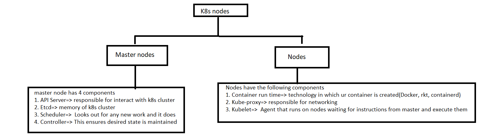
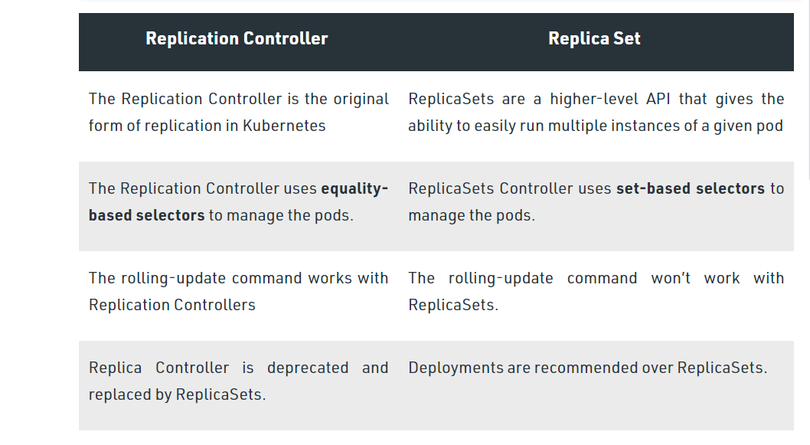

# kubernetes
    kubernetes is an open source container orchestration engine for automating deployment, scaling, and management of containerised applications
    => one of the major propertice of the k8s is self healing
* k8s is desigend to work with any container technology
* yaml files where we describe our desired state are called as manifests
## k8s Architecture
* 

### difference between replication controller and replicaset 

